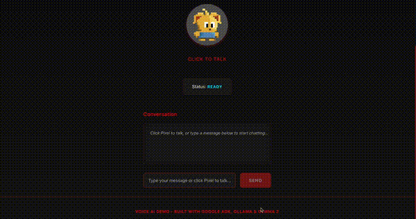
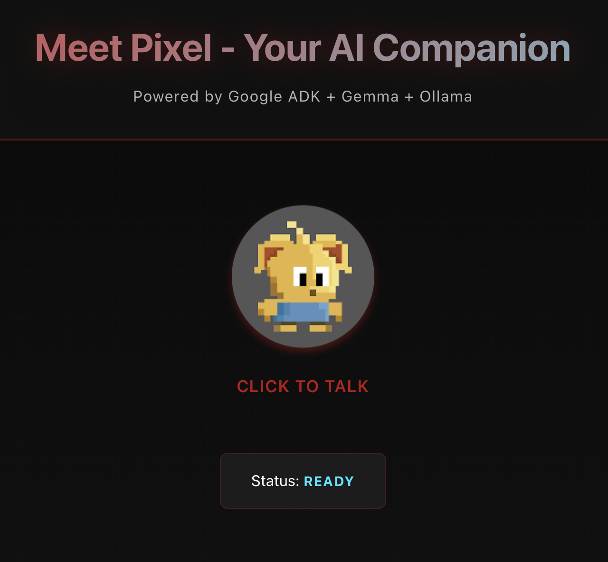
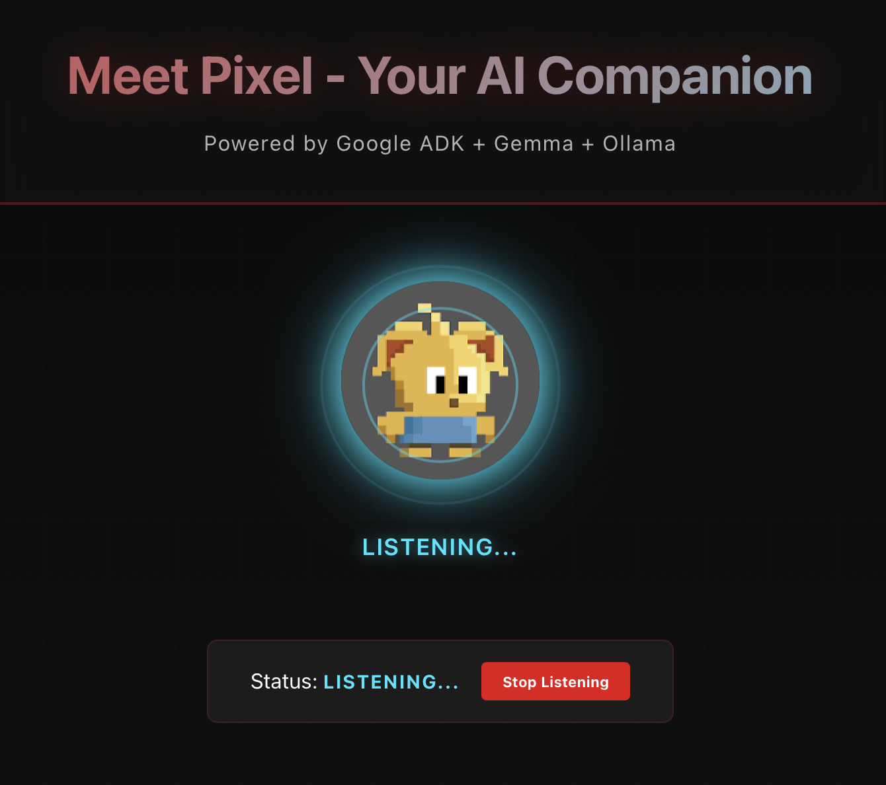
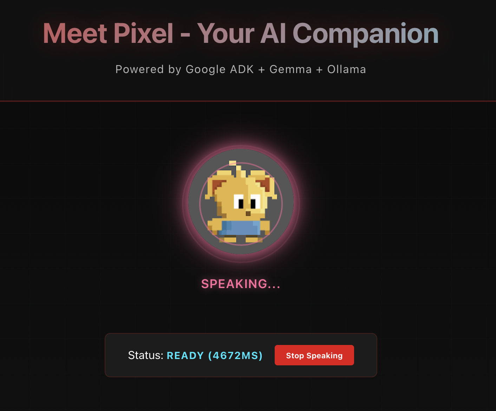

# Voice AI Agent with Multi-Agent Architecture

[](https://opensource.org/licenses/MIT)
[](https://nodejs.org/)
[](https://ollama.com/)
[](https://www.typescriptlang.org/)

> A production-ready voice AI agent built with a **Custom Multi-Agent Router Pattern** using local LLMs (FunctionGemma + Gemma 2) and function calling capabilities. 100% open source and runs completely locally with **no API costs**.

<!--
🎬 Add your demo here:

Or use a video:
[](https://youtu.be/your-video-id)
-->

**Keywords:** Multi-Agent AI, Function Calling, Local LLM, Voice AI, Ollama, FunctionGemma, Gemma 2, TypeScript AI Agent, No API Costs, Open Source AI

---

## 📋 Table of Contents

- [Key Features](#-key-features)
- [Demo & Screenshots](#-demo--screenshots)
- [Architecture Overview](#️-architecture-overview)
- [Project Structure](#-project-structure)
- [Core Components](#-core-components-explained)
- [How to Add a New Tool](#-how-to-add-a-new-tool)
- [Installation & Setup](#️-installation--setup)
- [Running the Application](#-running-the-application)
- [Testing](#-testing)
- [Customization Guide](#-customization-guide)
- [Debugging](#-debugging)
- [Architecture Decisions](#-architecture-decisions)

---

## 🎯 Key Features

- **Multi-Agent Router Pattern** - Two specialized LLMs working together
- **Function Calling** - Extensible tool system for any action
- **Voice Interaction** - Push-to-talk with Web Speech API
- **Animated AI Character** - Black Mirror "Plaything" inspired
- **100% Local** - No cloud dependencies, no API costs
- **Easily Extensible** - Add new tools in 3 simple steps

---

## 🎬 Demo & Screenshots

<!--
Add your demo video, GIFs, or screenshots here!

### Live Demo Video
[](https://youtu.be/your-video-id)

### Quick Demo GIF

*Watch Pixel respond to voice commands and execute tools in real-time*

### Screenshots
<table>
  <tr>
    <td></td>
    <td></td>
    <td></td>
  </tr>
  <tr>
    <td align="center"><b>Idle State</b><br/>Waiting for interaction</td>
    <td align="center"><b>Listening</b><br/>Processing voice input</td>
    <td align="center"><b>Speaking</b><br/>Responding with TTS</td>
  </tr>
</table>

### Tool Execution Demo

*Multi-agent workflow: FunctionGemma detects tool → Executes → Gemma 2 responds*
-->

---

## 🏗️ Architecture Overview

This project implements a **Multi-Agent Router Pattern** where two specialized LLMs work together:

<!--
Add your architecture diagram image here:

*Visual representation of the two-agent workflow*
-->

```
User Input
    ↓
┌─────────────────────────────────────────┐
│  FunctionGemma (Router Agent)           │
│  - Detects if tools are needed          │
│  - Makes tool calling decisions         │
└─────────────────────────────────────────┘
    ↓
    ├─ Tool Detected? ──→ Execute Tool ──┐
    │                                     ↓
    └─ No Tool? ─────────────────────────┐
                                          ↓
            ┌─────────────────────────────────────────┐
            │  Gemma 2:2b (Conversation Agent)        │
            │  - Generates natural responses          │
            │  - Maintains conversation context       │
            └─────────────────────────────────────────┘
                            ↓
                    Natural Response
```

### Why Two Agents?

- **FunctionGemma**: Specialized for tool detection (not good at conversation)
- **Gemma 2:2b**: Specialized for natural conversation (less reliable for tool calling)
- **Together**: They leverage each other's strengths for intelligent function calling!

---

## 📁 Project Structure

```
adk-nodejs/
├── backend/
│   ├── src/
│   │   ├── agent/
│   │   │   ├── voice-agent.ts       # ⭐ Multi-agent router orchestrator
│   │   │   └── prompts.ts           # System prompts (Pixel personality)
│   │   ├── models/
│   │   │   └── ollama-provider.ts   # Ollama client with function calling
│   │   ├── tools/
│   │   │   ├── definitions.ts       # ⭐ Tool schemas (ADD NEW TOOLS HERE)
│   │   │   └── registry.ts          # ⭐ Tool execution logic
│   │   ├── config/
│   │   │   ├── env.ts              # Environment configuration
│   │   │   └── models.ts           # Model settings
│   │   ├── pipeline/
│   │   │   └── response-pipeline.ts # Processing pipeline (TTS, etc.)
│   │   └── server.ts               # Express + Socket.io server
│   └── .env                        # Configuration file
├── frontend/
│   └── src/
│       └── App.tsx                 # ⭐ Frontend tool execution handler
└── README.md                       # This file
```

---

## 🔧 Core Components Explained

### 1. **Multi-Agent Router** (`backend/src/agent/voice-agent.ts`)

**Purpose**: Orchestrates the two-agent workflow.

**Key Code**:
```typescript
async processMessage(userInput: string): Promise<string> {
  // STEP 1: Router (FunctionGemma) checks for tool needs
  const routerResponse = await this.routerProvider.chat(messages, availableTools);

  // STEP 2: Branch based on decision
  if (routerResponse.message.tool_calls?.length > 0) {
    // BRANCH A: Tool detected → Execute → Gemma 2 responds
    const toolResults = await toolRegistry.executeTool(...);
    const response = await this.conversationProvider.chat(responseMessages);
    return response.message.content;
  } else {
    // BRANCH B: No tool → Gemma 2 handles conversation
    const response = await this.conversationProvider.chat(messages);
    return response.message.content;
  }
}
```

**Configuration** (Lines 36-51 in voice-agent.ts):
```typescript
// Router Agent (FunctionGemma)
const routerConfig = {
  model: 'functiongemma:latest',
  temperature: 0.3,  // Lower = more focused on tool detection
  maxTokens: 300,
};

// Conversation Agent (Gemma 2)
const conversationConfig = {
  model: 'gemma2:2b',
  temperature: 0.7,  // Higher = more creative responses
  maxTokens: 500,
};
```

---

### 2. **Tool System** (`backend/src/tools/`)

The tool system is fully extensible - you can add any tool in 3 steps!

#### Tool Definitions (`definitions.ts`)

**Purpose**: Define what tools are available to the agent.

**Current Tools**:
- `changeBackgroundColor` - Changes UI background color

**Example Tool Structure**:
```typescript
export const changeBackgroundColorTool: Tool = {
  type: 'function',
  function: {
    name: 'changeBackgroundColor',
    description: 'Changes the background color of the UI',
    parameters: {
      type: 'object',
      properties: {
        color: {
          type: 'string',
          description: 'Color name (e.g., "blue", "red", "green")',
        },
      },
      required: ['color'],
    },
  },
};

// Export all tools
export const availableTools: Tool[] = [
  changeBackgroundColorTool,
  // Add more tools here...
];
```

#### Tool Registry (`registry.ts`)

**Purpose**: Executes tools and manages frontend delegation.

**Key Features**:
- Executes backend tools directly
- Delegates to frontend via Socket.io for UI tools
- Handles tool execution promises and results

---

### 3. **Frontend Tool Handler** (`frontend/src/App.tsx`)

**Purpose**: Executes frontend-specific tools (UI changes, audio, etc.).

**How It Works** (Lines 113-157):
```typescript
socket.on('execute-tool', (data) => {
  switch (data.toolName) {
    case 'changeBackgroundColor':
      const appElement = document.querySelector('.app') as HTMLElement;
      appElement.style.background = data.parameters.color;

      socket.emit('tool-result', {
        executionId: data.executionId,
        success: true,
        result: { message: `Background changed to ${data.parameters.color}` },
      });
      break;

    // Add frontend tool handlers here...
  }
});
```

---

## 🚀 How to Add a New Tool

### Example: Adding a "Play Music" Tool

#### **Step 1**: Define the Tool (`backend/src/tools/definitions.ts`)

```typescript
export const playMusicTool: Tool = {
  type: 'function',
  function: {
    name: 'playMusic',
    description: 'Plays music based on genre or song name',
    parameters: {
      type: 'object',
      properties: {
        song: {
          type: 'string',
          description: 'Song name or genre (e.g., "jazz", "Bohemian Rhapsody")',
        },
        volume: {
          type: 'number',
          description: 'Volume level from 0 to 100',
        },
      },
      required: ['song'],
    },
  },
};

// Add to available tools
export const availableTools: Tool[] = [
  changeBackgroundColorTool,
  playMusicTool,  // ← Add here!
];
```

#### **Step 2**: Add Tool Handler (`backend/src/tools/registry.ts`)

```typescript
async executeTool(toolCall: ToolCall): Promise<ToolExecutionResult> {
  switch (toolCall.name) {
    case 'changeBackgroundColor':
      return await this.executeChangeBackgroundColor(toolCall.parameters);

    case 'playMusic':  // ← Add handler
      return await this.executePlayMusic(toolCall.parameters);

    default:
      return { success: false, error: `Unknown tool: ${toolCall.name}` };
  }
}

// Add the execution method
private async executePlayMusic(parameters: Record<string, any>): Promise<ToolExecutionResult> {
  if (!this.frontendToolEmitter) {
    return { success: false, error: 'Frontend tool emitter not configured' };
  }

  const { song, volume = 50 } = parameters;
  console.log('[TOOL] Delegating playMusic to frontend:', song);

  // Delegate to frontend
  const result = await this.frontendToolEmitter('playMusic', { song, volume });
  return result;
}
```

#### **Step 3**: Add Frontend Handler (`frontend/src/App.tsx`)

```typescript
newSocket.on('execute-tool', (data) => {
  switch (data.toolName) {
    case 'changeBackgroundColor':
      // ... existing code ...
      break;

    case 'playMusic': {  // ← Add frontend handler
      const { song, volume } = data.parameters;
      console.log('[APP] Playing music:', song);

      const audio = new Audio(`/music/${song}.mp3`);
      audio.volume = volume / 100;
      audio.play();

      newSocket.emit('tool-result', {
        executionId: data.executionId,
        success: true,
        result: { message: `Now playing ${song}` },
      });
      break;
    }
  }
});
```

#### **Step 4**: Test It!

User says: **"Play some jazz music"**

```
FunctionGemma detects → playMusic(song="jazz")
                      ↓
Tool Registry executes → Frontend plays audio
                      ↓
Gemma 2 responds → "🎵 Playing some smooth jazz for you!"
```

✅ **That's it!** The router automatically uses any tool in `availableTools[]`.

---

## 🔄 Communication Flow

### Complete Tool Execution Flow

```
1. User Input
   ↓
2. Voice Agent receives message
   ↓
3. FunctionGemma (Router) checks for tools
   ↓
   ├─ Tool detected?
   │  ↓
   │  4. Tool Registry executes tool
   │  ↓
   │  5. Frontend receives 'execute-tool' event
   │  ↓
   │  6. Frontend executes (UI change, audio, etc.)
   │  ↓
   │  7. Frontend sends 'tool-result' back
   │  ↓
   │  8. Gemma 2 generates natural response
   │
   └─ No tool?
      ↓
      4. Gemma 2 handles conversation directly
   ↓
9. Response sent to user
```

---

## ⚙️ Installation & Setup

### Prerequisites

Before you begin, ensure you have:

| Requirement | Minimum | Recommended | Check |
|------------|---------|-------------|-------|
| **Node.js** | 18.x | 20.x or later | `node --version` |
| **npm** | 9.x | 10.x or later | `npm --version` |
| **RAM** | 8GB | 16GB+ | - |
| **Disk Space** | 5GB | 10GB+ (for models) | - |
| **Ollama** | Latest | Latest | `ollama --version` |

**Operating System:**
- ✅ macOS (Intel & Apple Silicon)
- ✅ Linux (Ubuntu 20.04+)
- ✅ Windows 10/11 (WSL2 recommended for Ollama)

**Browser Requirements (for frontend):**
- ✅ Chrome 90+ (recommended - best Web Speech API support)
- ✅ Edge 90+
- ⚠️ Firefox 88+ (limited Web Speech API support)
- ⚠️ Safari 14+ (no Web Speech API support)

### Step-by-Step Setup

#### 1. Install Ollama

```bash
# macOS/Linux
curl -fsSL https://ollama.com/install.sh | sh

# Windows: Download from https://ollama.com/
```

#### 2. Pull Required Models

```bash
# Pull FunctionGemma (for tool detection)
ollama pull functiongemma:latest

# Pull Gemma 2 (for conversation)
ollama pull gemma2:2b

# Verify models are installed
ollama list
```

#### 3. Clone & Install

```bash
# Clone repository
git clone <your-repo-url>
cd adk-nodejs

# Install backend dependencies
cd backend
npm install
cd ..

# Install frontend dependencies
cd frontend
npm install
cd ..
```

#### 4. Configure Environment

The `.env` file is already configured. If needed, edit `backend/.env`:

```bash
PORT=3001
MODEL_PROVIDER=ollama
OLLAMA_BASE_URL=http://localhost:11434
OLLAMA_MODEL=qwen2.5:7b  # Not used (models hardcoded in voice-agent.ts)
ALLOWED_ORIGINS=http://localhost:5173,http://localhost:3000
```

---

## 🎮 Running the Application

You need **2 terminal windows**:

### Terminal 1: Start Backend

```bash
cd backend
npm run dev
```

**Output:**
```
[OLLAMA] Provider initialized: { model: 'functiongemma:latest' }
[OLLAMA] Provider initialized: { model: 'gemma2:2b' }
[AGENT] Multi-agent voice agent initialized
[AGENT] Router: functiongemma:latest
[AGENT] Conversation: gemma2:2b
✅ Agent connection successful

🎙️  Voice AI Agent Server Running
   HTTP Server:  http://localhost:3001
   Health Check: http://localhost:3001/health
```

### Terminal 2: Start Frontend

```bash
cd frontend
npm run dev
```

**Access:** Open browser at `http://localhost:5173`

---

## 🧪 Testing

### Test Tool Calling
```
User: "Change the background to blue"
Expected:
  1. FunctionGemma detects changeBackgroundColor tool
  2. Background changes to blue
  3. Gemma 2 responds: "✨ All done! The background is now a beautiful blue!"
```

### Test Conversation (No Tool)
```
User: "Hi, how are you?"
Expected:
  1. FunctionGemma detects no tool needed
  2. Gemma 2 responds conversationally: "Hey there! I'm doing great! 😊 How about you?"
```

### Test Multiple Requests
```
User: "Change to red"
User: "Now yellow"
User: "What's your name?"
Expected: All handled correctly with proper tool detection and responses
```

---

## 🎨 Customization Guide

### Change Agent Personalities

Edit `backend/src/agent/prompts.ts`:

```typescript
export const VOICE_AGENT_SYSTEM_PROMPT = `You are Pixel, a friendly AI assistant.

CRITICAL RULES:
1. NEVER use asterisks or action descriptions
2. Keep responses SHORT (2-4 sentences)
3. When users ask for tool actions, ALWAYS use the available tools

Your personality:
- Friendly and helpful
- Brief and conversational
- Use emojis to express emotion 😊

Remember: Keep it natural and voice-friendly!`;
```

### Change Models

Edit `backend/src/agent/voice-agent.ts` (lines 36-51):

```typescript
// Want different router model?
const routerConfig = {
  model: 'qwen2.5:7b',  // ← Change here
  // ...
};

// Want different conversation model?
const conversationConfig = {
  model: 'llama3.2:3b',  // ← Change here
  // ...
};
```

**Recommended Models**:
- **Router**: `functiongemma:latest`, `qwen2.5:7b` (good at tool calling)
- **Conversation**: `gemma2:2b`, `llama3.2:3b`, `qwen2.5:7b` (good at conversation)

### Adjust Model Parameters

```typescript
const conversationConfig = {
  model: 'gemma2:2b',
  temperature: 0.9,  // Higher = more creative (0.0-1.0)
  maxTokens: 800,    // Longer responses
};
```

---

## 🐛 Debugging

### Check Backend Logs

Look for the multi-agent workflow in terminal:

```
[AGENT] === MULTI-AGENT WORKFLOW START ===
[AGENT] STEP 1: Router (FunctionGemma) checking for tool calls...
[AGENT] ✓ Router detected tool call: changeBackgroundColor
[AGENT] STEP 2A: Executing tool: changeBackgroundColor with args: { color: 'blue' }
[TOOL REGISTRY] Executing tool: changeBackgroundColor
[TOOL] Delegating changeBackgroundColor to frontend: #0000FF
[AGENT] Tool result: { success: true, result: {...} }
[AGENT] STEP 3: Gemma 2 generating natural response...
[AGENT] === WORKFLOW COMPLETE (Tool + Response) ===
```

### Health Check

```bash
curl http://localhost:3001/health
```

### Verify Ollama Models

```bash
ollama list
ollama ps  # See running models
```

---

## 🏷️ Git Branches

### `feature/custom-multi-agent-router` (Current Implementation)
- Custom multi-agent router pattern
- Works with local Ollama models
- Production-ready
- **This is what you should use!**

### `main` (Old Implementation)
- Single-agent approach
- Less sophisticated tool calling

---

## 📊 Architecture Decisions

### Why Custom Instead of Google ADK?

| Feature | Google ADK | Custom Implementation |
|---------|-----------|----------------------|
| Framework Support | ✅ Full | ⚠️ Manual |
| Built-in Patterns | ✅ Yes | ⚠️ Need to implement |
| Local Models (Ollama) | ❌ Not designed for | ✅ Perfect for |
| Cloud Dependencies | ❌ Requires Gemini | ✅ None |
| Flexibility | ⚠️ Framework constraints | ✅ Full control |
| Cost | ❌ API costs | ✅ Free (local) |

**Decision**: Custom implementation for **local-first approach** with ADK-inspired patterns.

---

## 🤝 Contributing

Want to extend this project?

1. **Add tools**: Follow the "How to Add a New Tool" section
2. **Modify agents**: Update `voice-agent.ts` configurations
3. **Change personality**: Edit `prompts.ts`
4. **Add new agents**: Create new OllamaProvider instances

---

## 📄 License

MIT

---

## 🎯 Key Takeaways

✅ **Two agents work together**: FunctionGemma detects tools, Gemma 2 handles conversation
✅ **Easily extensible**: Add new tools in 3 steps
✅ **Frontend-backend tool delegation**: Tools can execute on either side
✅ **Local-first**: Runs entirely on local Ollama models
✅ **Production-ready**: Error handling, logging, and proper architecture
✅ **Not fixed to color tool**: The system works with ANY tool you add!

---

## 📞 Getting Help & Support

### Quick Troubleshooting

**Issue:** Backend won't start
```bash
# Check if Ollama is running
ollama ps

# Start Ollama if not running
ollama serve

# Check if models are downloaded
ollama list

# Should see: functiongemma:latest and gemma2:2b
```

**Issue:** Frontend can't connect
```bash
# Check backend is running
curl http://localhost:3001/health

# Check CORS settings in backend/.env
# ALLOWED_ORIGINS should include http://localhost:5173
```

**Issue:** Tool execution not working
```bash
# Check browser console for errors
# Look for 'execute-tool' and 'tool-result' events
# Check backend logs for [TOOL REGISTRY] messages
```

**Issue:** Voice input not working
- Ensure microphone permissions are granted
- Try Chrome/Edge (best Web Speech API support)
- Check browser console for "getUserMedia" errors

### Common Issues & Solutions

<details>
<summary><b>Error: "Model not found"</b></summary>

**Solution:**
```bash
# Pull the missing model
ollama pull functiongemma:latest
ollama pull gemma2:2b

# Verify installation
ollama list
```
</details>

<details>
<summary><b>Error: "Connection refused" on port 3001</b></summary>

**Solution:**
1. Check if port is already in use: `lsof -i :3001`
2. Kill existing process: `kill -9 <PID>`
3. Or change port in `backend/.env`: `PORT=3002`
</details>

<details>
<summary><b>Agent responds but tools don't execute</b></summary>

**Solution:**
1. Check FunctionGemma is running: Backend logs should show `[AGENT] Router: functiongemma:latest`
2. Check tool registry: Look for `[TOOL REGISTRY] Executing tool:` in logs
3. Check frontend connection: Browser console should show socket.io connected
</details>

<details>
<summary><b>Background color changes but I can't see it</b></summary>

**Solution:**
The `.app` div might have its own background. Check:
```javascript
// In frontend/src/App.tsx, the tool targets:
const appElement = document.querySelector('.app') as HTMLElement;
appElement.style.background = color;
```
</details>

<details>
<summary><b>High memory usage</b></summary>

**Solution:**
- FunctionGemma + Gemma 2 together use ~4-5GB RAM
- Consider using smaller models:
  ```typescript
  // In voice-agent.ts
  model: 'gemma2:2b'  // 1.6GB
  // vs
  model: 'gemma2:9b'  // 5GB
  ```
</details>

### 🐛 Report an Issue

Found a bug or need help?

1. **Check existing issues:** [GitHub Issues](https://github.com/your-repo/issues)
2. **Create new issue:** Include:
   - What you were trying to do
   - What happened instead
   - Backend logs (last 20 lines)
   - Browser console errors
   - Your setup (OS, Node version, Ollama version)

**Useful debug commands:**
```bash
# Get system info
node --version
npm --version
ollama --version

# Get backend logs (last 50 lines)
# (If running with npm run dev, logs are in terminal)

# Check Ollama models
ollama list

# Test Ollama connection
curl http://localhost:11434/api/tags
```

### 💬 Community & Discussions

- **Questions?** Open a [GitHub Discussion](https://github.com/your-repo/discussions)
- **Feature requests?** Open an [issue with "enhancement" label](https://github.com/your-repo/issues)
- **Want to contribute?** See [Contributing](#-contributing)

### 📚 Additional Resources

- [Ollama Documentation](https://github.com/ollama/ollama)
- [FunctionGemma Model Card](https://huggingface.co/google/functiongemma-2b)
- [Web Speech API Docs](https://developer.mozilla.org/en-US/docs/Web/API/Web_Speech_API)
- [Socket.io Documentation](https://socket.io/docs/v4/)

---

## ❓ Frequently Asked Questions (FAQ)

<details>
<summary><b>Q: Do I need an API key or internet connection?</b></summary>

**A:** No! Everything runs 100% locally:
- Ollama models run on your machine
- No API keys required
- No cloud dependencies
- Works completely offline (after initial model download)
</details>

<details>
<summary><b>Q: How much does it cost to run?</b></summary>

**A:** $0! It's completely free:
- Open source code (MIT license)
- Free local models via Ollama
- No API costs
- No subscriptions

Only costs are:
- Electricity to run your computer
- Initial disk space for models (~3-4GB)
</details>

<details>
<summary><b>Q: Can I add my own tools/functions?</b></summary>

**A:** Yes! The system is fully extensible. Follow the [How to Add a New Tool](#-how-to-add-a-new-tool) guide. You can add:
- UI manipulation tools
- API calling tools
- Database operations
- File system operations
- Any JavaScript/TypeScript function!
</details>

<details>
<summary><b>Q: Why use two LLMs instead of one?</b></summary>

**A:** Specialization improves reliability:
- **FunctionGemma** is optimized for tool detection but poor at conversation
- **Gemma 2** excels at conversation but less reliable for tool calling
- Together they combine the best of both worlds
- This is a proven "router pattern" used in production systems
</details>

<details>
<summary><b>Q: Can I use different models?</b></summary>

**A:** Yes! Edit `backend/src/agent/voice-agent.ts`:
```typescript
// Router (needs good tool calling)
model: 'qwen2.5:7b'  // Alternative to FunctionGemma

// Conversation (needs good chat)
model: 'llama3.2:3b'  // Alternative to Gemma 2
```

Recommended alternatives:
- **Router**: `qwen2.5:7b`, `mistral:7b`
- **Conversation**: `llama3.2:3b`, `gemma2:2b`, `phi3:mini`
</details>

<details>
<summary><b>Q: Does this work on Windows?</b></summary>

**A:** Yes, but with considerations:
- Ollama works best with WSL2 on Windows
- Node.js/npm run natively on Windows
- Frontend works in any modern browser
- Some users report better performance with WSL2
</details>

<details>
<summary><b>Q: How do I deploy this to production?</b></summary>

**A:** Deployment options:
1. **VPS/Cloud Server**: Deploy backend + Ollama on same server
2. **Docker**: Containerize backend + Ollama
3. **Frontend**: Deploy to Vercel/Netlify (static hosting)
4. **Ollama**: Needs GPU for best performance in production

Note: Ollama models need significant RAM/VRAM for production load.
</details>

<details>
<summary><b>Q: Can I use this commercially?</b></summary>

**A:** Yes! MIT License allows commercial use:
- ✅ Use in commercial products
- ✅ Modify as needed
- ✅ Private/closed source derivatives
- ✅ No attribution required (but appreciated!)

Check individual model licenses:
- FunctionGemma: [Gemini Terms](https://ai.google.dev/gemma/terms)
- Gemma 2: [Gemini Terms](https://ai.google.dev/gemma/terms)
</details>

<details>
<summary><b>Q: The agent is slow. How can I speed it up?</b></summary>

**A:** Optimization tips:
1. **Use smaller models**: `gemma2:2b` instead of `gemma2:9b`
2. **GPU acceleration**: Ollama uses GPU if available (NVIDIA/AMD)
3. **Reduce maxTokens**: Lower = faster responses
4. **Increase temperature**: Slightly faster (but less focused)
5. **SSD storage**: Faster model loading
6. **Close other apps**: Free up RAM

Expected response times:
- Tool detection (FunctionGemma): ~200-500ms
- Response generation (Gemma 2): ~500-1500ms
- Total: 1-2 seconds on modern hardware
</details>

<details>
<summary><b>Q: Can I use OpenAI/Anthropic models instead?</b></summary>

**A:** Currently optimized for Ollama, but you can adapt:
1. Implement new provider in `backend/src/models/`
2. Update `voice-agent.ts` to use new provider
3. Add API key handling in config

Note: This defeats the "local-first, no API cost" philosophy, but it's technically possible!
</details>

<details>
<summary><b>Q: Is my data private?</b></summary>

**A:** 100% private:
- All processing happens locally on your machine
- No data sent to external servers
- No telemetry or tracking
- Models run completely offline
- Only frontend-backend communication (localhost)
</details>

---

**Built with ❤️ using Ollama, TypeScript, and Socket.io**

**Last Updated:** 2025-12-29
**Status:** Production Ready 🚀
